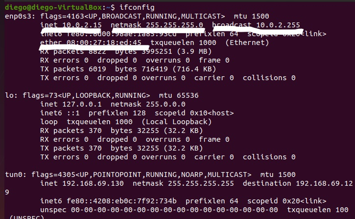

# Bootcamp 1 de Redes
## Respuesta Pregunta 1
- “Interfaz” de red ¿Qué es? ¿Cómo se identifica?

Una interfaz de red es un punto de conexión entre un dispositivo y una red pública o privada permitiendo el paso de paquetes. Para identificar una interfaz de red de otra interfaz se hace por medio de la dirección IP.
- En el caso de su computadora de escritorio o
Laptop, ¿qué potenciales interfaces de red puede identificar?

Conexión por medio de cable ethernet.

Conexión por medio de wifi.

Conexión por medio de cable usb.

Conexión por medio de bluetooth.

-  Incluya el resultado de ejecutar
“ifconfig” en su computadora, y marque los campos más importantes.

Ejemplo de usar ifconfig, en este caso el indicador tun0 se refiere a un tunel y este no se puede asociar a un dispositivo físico

## Respuesta Pregunta 2

- En el universo de TCP/IP, ¿Qué es un “host”?

El término host es usado en informática para referirse a las computadoras
conectadas a una red, que proveen y utilizan servicios de ella.
- ¿Qué es una “red”?

Una red de computadoras es un conjunto de
equipos conectados por medio de cables, señales,
ondas o cualquier otro método de transporte de
datos, que comparten información, recursos y servicios.

- Usando la salida de ifconfig del
ejercicio anterior, indique cuál es la red a la que está conectada cada interfaz, y cuál es el número de host respectivo.

- Enp0s3:

Host:15
Red: 10.0.2.0  

## Respuesta Pregunta 3
- ¿Qué es la interfaz loopback? ¿Para qué sirve?  ¿Es accesible desde el exterior?

La interfaz loopback es un interfaz virtual que representa al propio dispositivo independiente de la dirección IP que se la haya asignado. Está interfaz sirve de identificador de un dispositivo con el rauter ya que estas interfaces nunca se caen y no accesible desde el exterior.

- ¿El nombre localhost es un hostname que es visible desde el exterior?

No es visible desde el exterior.

## Respuesta Pregunta 4
- ¿Qué es un firewall?

Un firewall es un sistema de seguridad para bloquear accesos no autorizados a una computadora mientras sigue permitiendo la comunicación de la computadora con otros servicios autorizados.

-  ¿Cómo pueden verificar si tienen un firewall operativo en su máquina?

Mediante el comando **ufw status** se puede verificar si el firewall esta activado.

Para activar el firewall se usa el comando **ufw enable**

-  ¿Cómo lo deshabilitan?

Para deshabilitar el firewall se usa el comando **ufw disable**
## Respuesta Pregunta 5
- ¿Qué es un puerto?

Un puerto en informática es un conector ya sea interno o externo que se utiliza para comunicar diferentes tipos de elementos de hardware o elementos de software que nos permitan enviar y recibir datos de un dispositivo a otro.

- Si se usa el puerto n en TCP, ¿se puede usar al mismo tiempo en UDP? ¿Por qué
sí o por qué no?

Si se puede por que como son protocolos diferentes mientras se utilice para un servicio diferente los dos si se pueden conectar a un mismo puerto al mismo tiempo.

- ¿Qué son los “puertos bien conocidos”?

Los puertos bien conocidos son puertos lógicos cuyo rango comprende hasta el 1023.Estos puertos se encuentran "reservados" para programas y protocolos ya establecidos y solo un super usuario puede usar estos puertos.
- ¿Por qué los puertos debajo de 1024 están reservados?

Estos puertos están reservados para protocolos ya establecidos como FTP, HTTP, HTTPS, SSH, entre otros. Debido a esto por cuestiones de seguridad solo el usuario root puede manipular estos puertos.

## Respuesta Pregunta 6

Este comando se utiliza para conectarse con otra máquina que está escuchando en el puerto 10002 e intercambiar mensajes.

Este comando se utiliza para escuchar en un puerto que en este caso es el 2000 y se recibe una conexión de otra computadora para intercambiar mensajes.
## Respuesta Pregunta 7

En este ejemplo se utilizó el comando **nc** para conectarse con el servidor web de Google. El comando lo que mostro fue información de la página y el código html de la misma.

## Respuesta Pregunta 8

En este ejemplo se utilizó el comando **nc** con la bandera **-z** para verificar que puertos estaban abiertos al tratar de comunicarse con otra máquina.

## Referencias
Camacho, A (s.f)."actividad-3".Recuperado de:https://camachoacoivett.files.wordpress.com/2015/03/actividad-3.pdf

Chávez, A (s.f)."Puertos bien conocidos, puertos registrados y puertos efímeros". Recuperado de:
     https://alanchavez.com/puertos-bien-conocidos-puertos-registrados-y-puertos-efimeros/

Diaz, A(2011)."¿Para qué se Utiliza la interfaz Loopback en protocolos de ruteo dinámico como OSPF?". Recuperado de: http://segweb.blogspot.com/2011/10/si-tienes-informacion-adicional-sobre_17.html

Gorgona, L (s.f)."Teoría de Redes de Computadoras”. Recuperado de :
     https://www.oas.org/juridico/spanish/cyber/cyb29_computer_int_sp.pdf

Kurose, J y Ross, K (2017). "REDES DE COMPUTADORAS Un enfoque descendente”. Madrid, España. PEARSON EDUCACIÓN.

(s.f)."Como Habilitar y Configurar el Firewall UFW en Ubuntu". Recuperado de:
     https://computernewage.com/2014/08/10/como-configurar-el-firewall-ufw-en-ubuntu/
