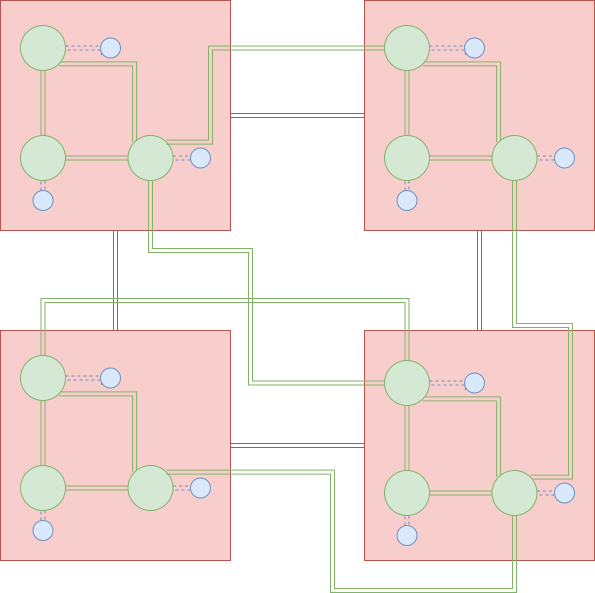
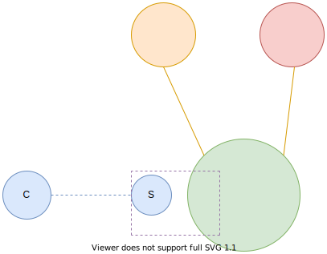
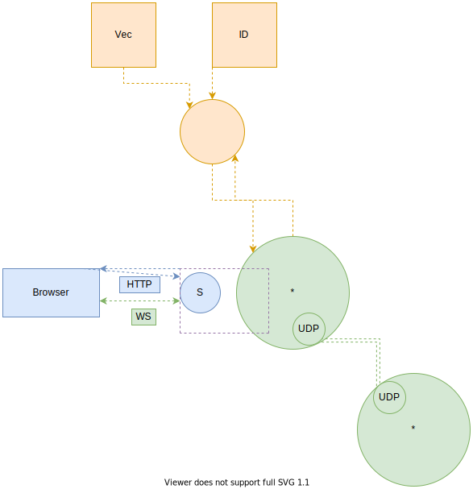
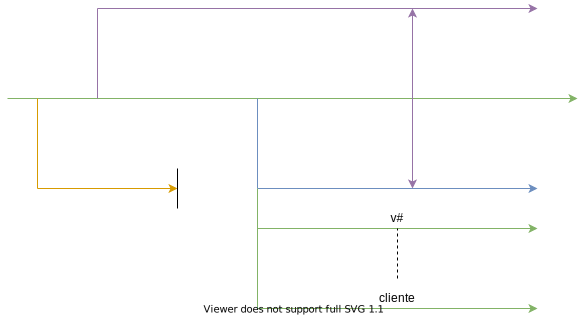

# Análisis personal del proyecto

#### Elaborado por:  Juan José Herrera Rodríguez
#### Carnet: B83878

## Descripción general del problema a resolver

La idea del proyecto es montar una red virtual sobre una red existente en donde los actores puedan enviar mensajes por medio de interfaces gráficas como buscadores web. El siguiente gráfico ayudará a tener una visión más clara del proyecto en general.

Como se puede observar en la Figura 1, la idea es que en los cuadros rojos (máquinas reales que pertenecen a una red real) se monten nodos verdes(procesos) que puedan participar en una red virtual que funcione tanto con nodos verdes dentro de un nodo rojo como con otros nodos verdes de otros nodos rojos con algún tipo de tipología, para poder mandarse información entre nodos verdes.

En la siguiente imagen se pueden apreciar más detalladamente los componentes que tendrá cada nodo verde.

Cada nodo verde tendrá un nodo naranja que le dé información a cada nodo verde sobre quién es el y cuales son sus vecinos.

Luego están los nodos rosados que controlan aspectos como el movimiento de los procesos, el nivel de congestionamiento, ruteo, entre otros.

También se pueden apreciar los nodos azules, con una "S", que son los servidores web que permiten una comunicación adecuada con los actores, los cuales pueden enviar y recibir mensajes por el buscador web que utilicen.

## Fase 1
En la fase 1 se pretende que se construyan los módulos que muestran en el siguiente gráfico.

También la siguiente imagen muestra la línea de tiempo que tendrán los nodos creados en el gráfico anterior.

- Primero se crea el nodo verde que al inicio es un cavernícola. No sabe quién es él ni sabe quienes son sus vecinos. Se llama asterisco. Lo referente a este nodo será escrito en C.

- Luego el nodo verde crea al nodo naranja, el cual le toca leer y transmitir la información del archivo de identificación para el nodo verde. Este archivo contiene un número de 2 bytes que será el nuevo nombre del nodo verde y el número de puerto UDP que va a utilizar el nodo verde para comunicarse con otros nodos verdes. No es necesario que este archivo incluya el ip ya que ese se puede leer de la máquina en la cual el nodo verde está alojado.
También el nodo naranja va a leer y transmitir la información del archivo de vecinos para el nodo verde. Este archivo contiene: el número de cada vecino, el ip adonde se va a buscar el vecino y el número de puerto en el cuál los vecinos van a esperar a el nodo verde.
Para transmitir esta información al nodo verde se puede utilizar memoria compartida, un pipe, entre otros.
Una vez que el nodo naranja realiza estas labores, va a recibir un mensaje del nodo verde, en donde le indica al naranja que ya terminó su labor y el nodo verde cierra al nodo naranja. Lo referente al nodo naranja será escrito en Python.

- Ahora el nodo verde va a establecer un servidor de comunicación con el nodo azul. Esta comunicación está representada por el cuadrado morado del gráfico, ya que el servidor web no utiliza el lenguaje C para comunicarse, sino otros recursos. El actor se comunicará por medio de un navegador web. Es posible que haya varias interfaces web que se conecten a un mismo nodo azul. Para establecer la comunicación inicial se utilizará el protocolo HTTP pero, para el resto de la comunicación se utilizará un web socket, que funcione entre el actor y el servidor web.

- Seguidamente el nodo verde establece un servidor de comunicación por cada uno de sus vecinos. Además, establece un cliente que es el que va a enviar información a los vecinos. Ahora se puede establecer el enlace de comunicación del nodo verde con sus vecinos. La comunicación será vía el protocolo UDP, ya que es un protocolo sumamente sencillo. Al nodo verde se le asigna un puerto que corresponde a un número de 2 bytes, que es por donde se establece el canal de comunicación entre nodos verdes y los vecinos.

## Sección de preguntas

- ¿Cuándo se cambia el nombre del nodo verde?
- ¿Cuándo se establece el puerto UDP de cada nodo verde?
- ¿Cómo funciona la conexión entre los servidores web y los nodos verdes?

